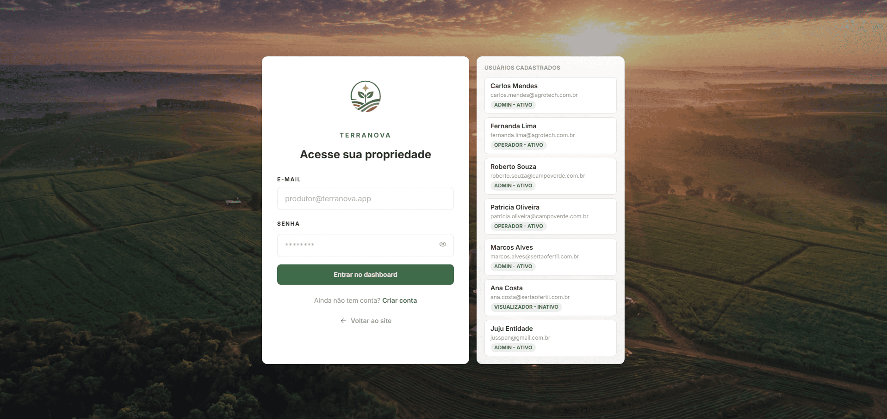
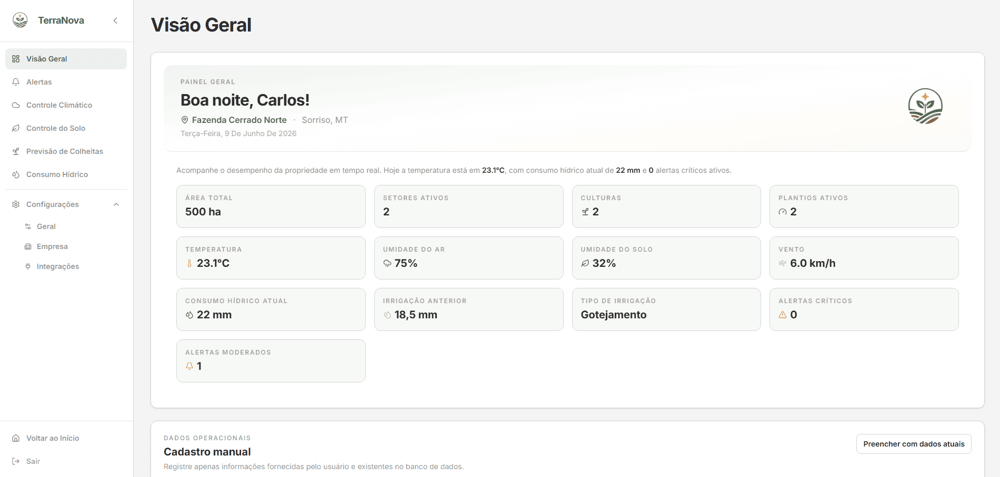
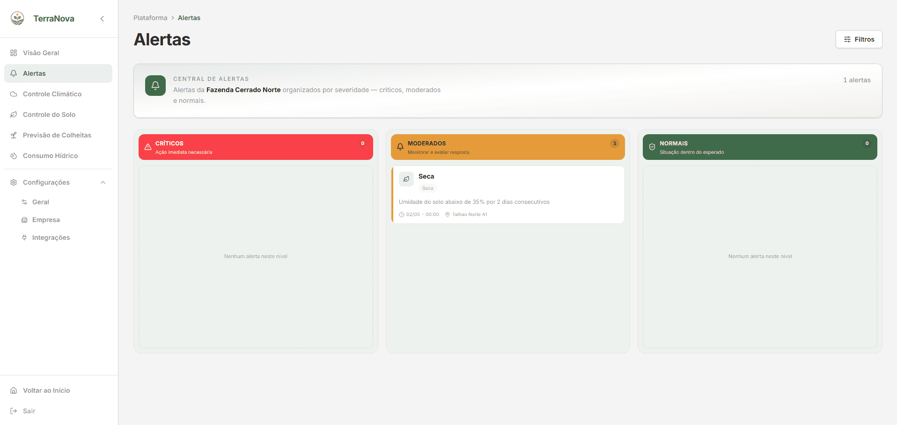
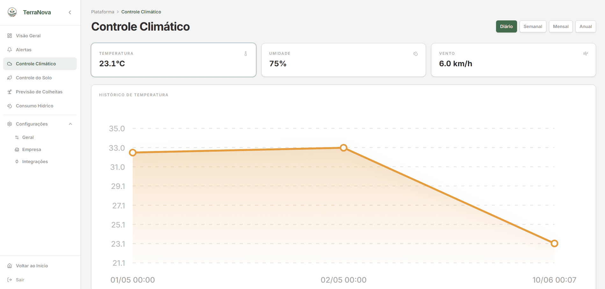
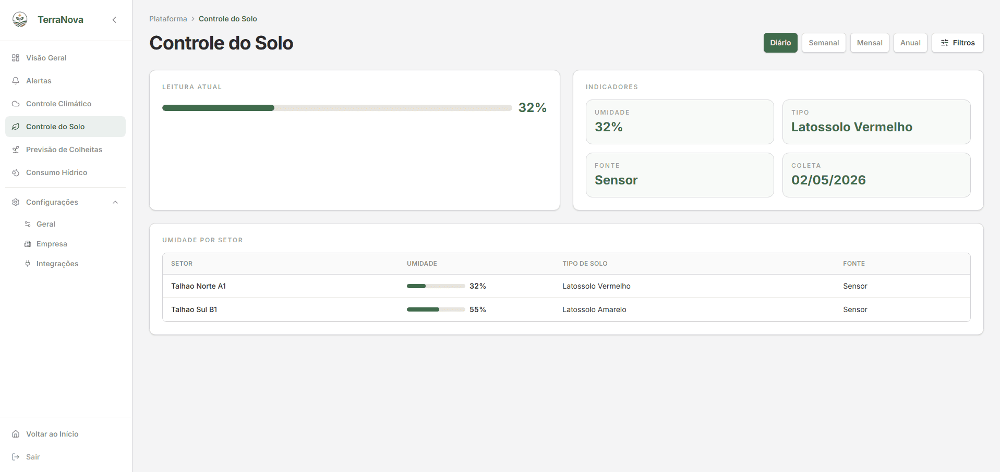
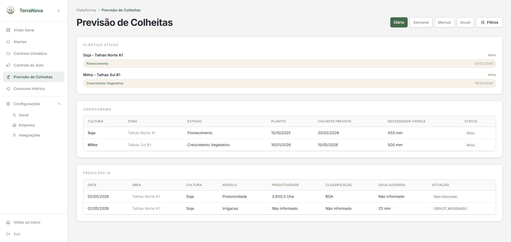
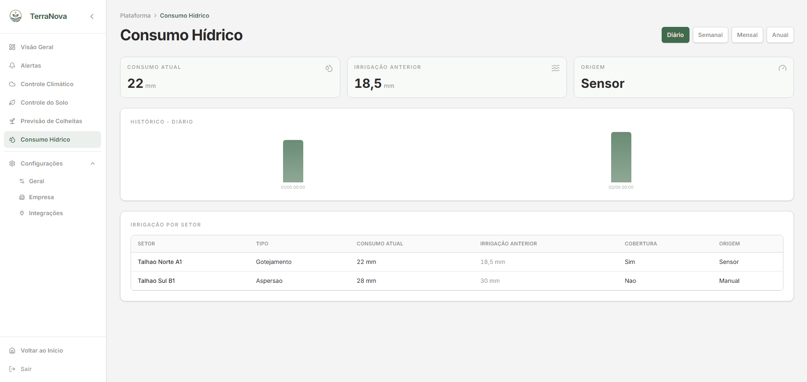
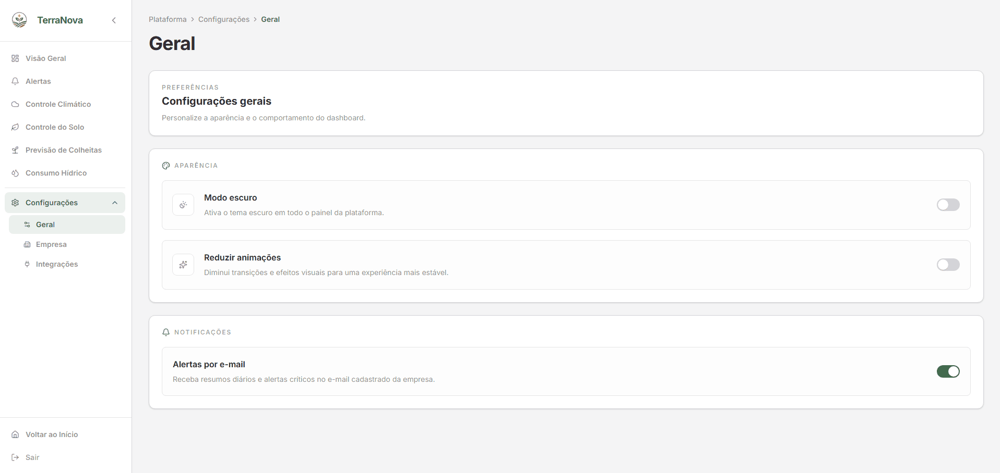
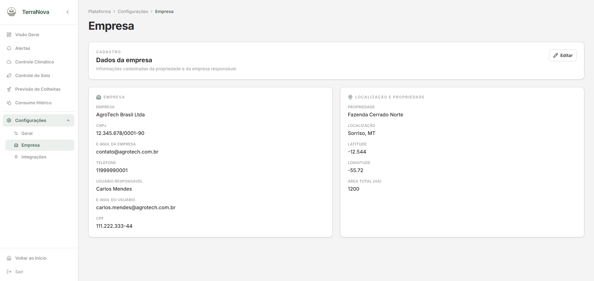
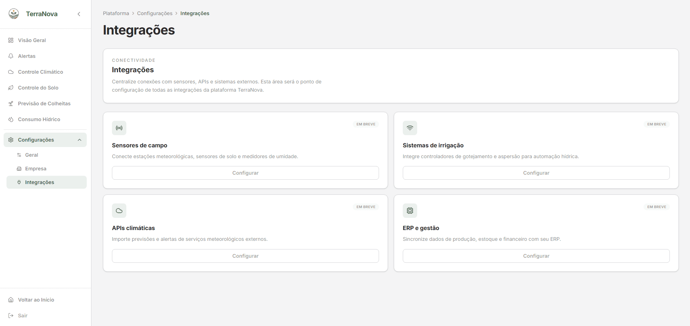

<div align="center">
  
<br>

## Plataforma de Inteligência Climática para Decisões mais Eficientes
Enquanto o clima muda, a tecnologia evolui. O TerraNova conecta dados, inteligência e sustentabilidade para transformar o futuro da agricultura.

<div>
  
  
  
</div>

<br/>

🔗 **Acesse o repositório do projeto**
👉 [github.com/juspanopoulos/TerraNova](https://github.com/juspanopoulos/TerraNova)

🔗 **Acesse o vídeo:**
👉 [YouTube](https://youtu.be/ltrJ9CrQaRA)

🔗 **Veja o site online:**
👉 [terra-nova-delta.vercel.app](https://terra-nova-delta.vercel.app/)

<br/>


<br/>

<div align="left">
  
> Projeto desenvolvido durante o curso da **FIAP** para o **Global Solution**.

> Este repositório contém o Front-End do site institucional e do dashboard do TerraNova. O objetivo é fornecer uma experiência de usuário impecável, rápida e totalmente responsiva para apresentar a solução TerraNova ao mercado corporativo.

---

<br/>

## 🌱 Sobre o Projeto
O TerraNova é uma plataforma de gestão rural desenvolvida para ajudar produtores a compreender, monitorar e cuidar de suas propriedades de forma mais simples e estratégica. Em muitas fazendas, informações importantes estão espalhadas entre planilhas, aplicativos e observações de campo, dificultando a tomada de decisões e aumentando o risco de problemas passarem despercebidos.

Entre os desafios mais comuns estão:
- Falta de uma visão clara da propriedade
- Dificuldade para acompanhar recursos hídricos
- Mudanças climáticas e ambientais sem monitoramento contínuo
- Informações dispersas e difíceis de consultar
- Identificação tardia de riscos e ocorrências

O TerraNova centraliza essas informações em um ambiente visual e intuitivo, transformando dados da propriedade em conhecimento prático para o dia a dia do produtor.
> 💡 Mais do que um sistema de gestão, o TerraNova foi concebido como uma ferramenta de apoio à tomada de decisão, conectando tecnologia, sustentabilidade e gestão rural em uma única plataforma.

<br/>

## 🎯 Proposta do Projeto

O objetivo do TerraNova é tornar a gestão da propriedade mais acessível, organizada e preventiva, reunindo:

- Monitoramento ambiental inteligente
- Gestão e acompanhamento de recursos hídricos
- Visualização simplificada da propriedade
- Alertas e acompanhamento de ocorrências
- Informações centralizadas para tomada de decisão

Criando uma experiência que permite ao produtor entender sua propriedade com mais clareza, agir com antecedência e dedicar menos tempo à burocracia e mais tempo ao que realmente importa: produzir de forma sustentável e eficiente.

<br/>

## ✨ Funcionalidades Principais

| Funcionalidade | Descrição |
| :--- | :--- |
| 📊 Visão Geral da Propriedade | Painel de boas-vindas com indicadores consolidados de clima, solo, água, alertas e colheitas da fazenda cadastrada. |
| 🗓️ Visões Temporais | Análise por dia, semana, mês e ano com KPIs, gráficos e tabelas reunindo clima, solo, água, irrigação e alertas do período. |
| 🔔 Central de Alertas | Alertas ambientais organizados em kanban por severidade — crítico, moderado e normal — com tipo, setor e horário. |
| 🌤️ Controle Climático | Monitoramento de temperatura, umidade e vento, com histórico gráfico e alternância entre métricas. |
| 🌱 Controle do Solo | Umidade do solo por setor, tipo, fonte da leitura e histórico gráfico por período temporal. |
| 🌾 Previsão de Colheitas | Cronograma de plantios ativos, gráfico por cultura e tabela de predições de IA (produtividade, classificação e volume hídrico sugerido). |
| 💧 Consumo Hídrico | Indicadores de consumo, histórico, distribuição por setor e tabela de irrigação com comparativos por período. |
| 🔍 Filtros Avançados | Painel lateral de filtros por período, mês, nível e tipo de alerta, setor do solo e cultura, conforme a view ativa. |
| 📊 Exportação Excel | Exportação da visão temporal (dia, semana, mês ou ano) em planilha compatível com Excel, com dados da propriedade e alertas. |
| 🏷️ Gestão de Prioridade | Classificação visual de alertas por urgência, com chips, cores e colunas dedicadas no quadro kanban. |
| 🛠️ Operações da Propriedade | Na visão geral, cadastro de áreas monitoradas, leituras de solo, irrigação e plantios, coleta climática NASA e predição de irrigação via IA. |
| 🏢 Cadastro da Propriedade | Fluxo de login, registro de usuário e cadastro da empresa/propriedade integrados à API Java, com validação de campos. |
| ⚙️ Configurações Gerais | Personalização do painel com modo escuro, redução de animações e preferência de alertas por e-mail, sincronizadas com a API. |
| 🔗 Integrações Externas | Área preparada para conectar sensores, irrigação, APIs climáticas e ERP — atualmente marcada como “Em breve”. |
| 🧭 Navegação e Breadcrumb | Sidebar com módulos da plataforma, breadcrumb por rota e hub de acesso às visões temporais. |
| 📱 Interface Responsiva | Layout adaptável com sidebar, toolbar, cards e gráficos ajustados para desktop e dispositivos móveis. |

<br/>

## 🚀 Conheça o TerraNova

Explore as principais telas da plataforma TerraNova — da autenticação ao monitoramento da propriedade.

| **Preview** | **Módulo** |
| :--: | :--- |
|  | **Login e cadastro**<br><br>Entrada segura na plataforma com fluxo de autenticação, registro de usuário e vinculação de empresa e propriedade. |
|  | **Painel de boas-vindas**<br><br>Primeira impressão após o login: saudação contextual, indicadores rápidos e acesso direto às visões da propriedade. |
|  | **Visão Geral**<br><br>Hub unificado com indicadores da propriedade, clima, solo, água e alertas — além do painel operacional para cadastrar áreas, leituras e plantios. |
|  | **Alertas**<br><br>Antecipe riscos como seca, geada e déficit hídrico com sinais claros, organizados em kanban por criticidade. |
|  | **Controle Climático**<br><br>Temperatura, umidade e vento reunidos em gráficos e histórico, com alternância entre métricas e recortes temporais. |
|  | **Controle do Solo**<br><br>Monitore umidade e saúde do solo por setor, com leituras que orientam irrigação e manejo da propriedade. |
|  | **Previsão de Colheitas**<br><br>Acompanhe plantios ativos, cronograma de colheita e predições de IA com produtividade e volume hídrico sugerido. |
|  | **Consumo Hídrico**<br><br>Eficiência de irrigação, comparativos por setor e histórico de consumo com metas visíveis para economia de água. |
|  | **Configurações gerais**<br><br>Personalize o painel com modo escuro, redução de animações e preferências de alertas por e-mail. |
|  | **Dados da empresa**<br><br>Edite informações da empresa, propriedade e usuário responsável, sincronizadas com a API do backend. |
|  | **Integrações**<br><br>Área preparada para conectar sensores, irrigação, APIs climáticas e ERP — atualmente marcada como “Em breve”. |
|  | **Página não encontrada**<br><br>Experiência amigável quando a rota não existe, com mensagem contextual e opções de voltar ou ir ao início. |

<br/>

## 📐 Responsividade
O layout foi desenvolvido para funcionar perfeitamente em:

- 📱 Mobile (até 480px)
- 📲 Tablet (até 768px)
- 💻 Desktop (992px+)
- 🖥️ Telas grandes (1300px+)

<br/>

## 🚀 Stack Tecnológica

O front-end do **TerraNova** foi desenvolvido com tecnologias de ponta para garantir performance, segurança e uma experiência de usuário fluida.


| Tecnologia | Função / Uso | Descrição |
| :--- | :--- | :--- |
|  | **Interface do Usuário** | Biblioteca principal para criação de interfaces baseadas em componentes reutilizáveis. |
|  | **Linguagem** | Superset de JavaScript que adiciona tipagem estática e segurança ao código. |
|  | **Build Tool** | Ferramenta de build de próxima geração para um ambiente de desenvolvimento ágil e otimizado. |
|  | **Roteamento** | Gerenciamento de rotas e navegação dinâmica single-page entre as visões da plataforma. |
|  | **Estilização** | Framework utility-first para um design moderno, totalmente responsivo e de carregamento rápido. |
|  | **Animações** | Motor de animações robusto e de alta performance para transições fluidas de elementos visuais. |
|  | **Scroll Suave** | Biblioteca de scroll suave (smooth scroll) integrada para aprimorar a experiência de navegação. |
|  | **Ícones** | Conjunto de ícones vetoriais consistentes, leves e otimizados para componentes React. |
|  | **Formulários** | Gerenciamento de estado de formulários focado em performance, validação e redução de re-renders. |
|  | **Tipografia** | Família tipográfica Inter carregada via Fontsource para garantir consistência e legibilidade. |

<br/>

## 💻 Entregas Funcionais

Abaixo estão as funcionalidades centrais implementadas no Frontend:

| Categoria | Tecnologia / Recurso | Status | Uso no Projeto |
| :-------- | :------------------- | :----: | :------------- |
| **Definição de Rotas** | **React Router DOM v7** | :heavy_check_mark: | Estruturação central em `src/routes/AppRoutes.tsx`, com rotas do site institucional e rotas aninhadas da plataforma sob `DashboardLayout`. URLs tipadas em `src/constants/routes.ts` e `src/constants/dashboard.ts`. |
| **Navegação SPA** | **Navegação fluida (sem reload)** | :heavy_check_mark: | `BrowserRouter`, `NavLink`, `Link`, `Outlet` e `Navigate` garantem troca de páginas sem recarregar o documento. Ex.: `Navbar.tsx`, `Sidebar.tsx`, `HomeNavbar.tsx`. |
| **Rotas aninhadas e redirecionamento** | **Nested Routes + Navigate** | :heavy_check_mark: | `/plataforma` redireciona para `visao-geral`; `/plataforma/configuracoes` para `geral`; alias `/platform` → `/plataforma`. Configurado em `AppRoutes.tsx`. |
| **Interpretação de rotas** | **Segmentos estáticos + funções tipadas** | :heavy_check_mark: | O projeto não usa `useParams`. O `pathname` é interpretado por funções como `pathToViewId()`, `TIME_FILTER_FROM_PATH()`, `pathToSettingsTab()` e `breadcrumbsFromPath()` em `constants/dashboard.ts`. |
| **Feedback ao usuário** | **Estados de carregamento e erro** | :heavy_check_mark: | `DashboardLoadingState` e `DashboardErrorState` no dashboard; estados `isLoading` / `error` na equipe (`useTeamMembers` + `TeamSection.tsx`); mensagens de validação nos formulários de auth e contato. |
| **Criação de tipos de dados** | **TypeScript 6** | :heavy_check_mark: | Tipagem estática em todo o projeto (`npm run typecheck`). Domínios organizados em `src/types/dashboard.ts` e `src/types/equipe.ts`. |
| **Tipos básicos** | **string, number, boolean, arrays e object** | :heavy_check_mark: | Utilizados em formulários, conteúdo estático e componentes. Ex.: `faq.ts`, `CompanyProfile`, métricas de clima/solo/água no `DashboardContext`. |
| **Type aliases** | **type** | :heavy_check_mark: | Modelagem principal via `type` para entidades e contratos. Ex.: `CompanyProfile`, `AlertItem`, `TeamMemberData`, `BreadcrumbItem`, `PageFilters` em `FilterSlideover.tsx`. |
| **Union types** | **Tipos literais restritivos** | :heavy_check_mark: | Garantem valores válidos em rotas, auth e dashboard. Ex.: `AuthMode = "login" \| "register" \| "registerCompany"`, `ViewId`, `TimeFilter`, `AlertLevel`, `DashboardLoadStatus`. |
| **Intersection types** | **Composição de tipos** | :heavy_check_mark: | Combinação de estruturas para enriquecer dados carregados. Ex.: `TeamMember = TeamMemberData & { photo: string }` em `types/equipe.ts`. |
| **Tipos avançados** | **Record, Partial, keyof, generics, as const** | :heavy_check_mark: | `Record<ViewId, string>` em `PAGE_TITLES`; `Partial<Record<keyof CompanyProfile, string>>` em validação de cadastro; `updatePreference<K extends keyof GeneralPreferences>`; `ROUTES` e `DASHBOARD_ROUTES` com `as const`. |
| **Responsividade total** | **Tailwind CSS 4 (mobile / tablet / desktop)** | :heavy_check_mark: | Layout adaptável com breakpoints `sm:`, `md:`, `lg:` em site institucional e dashboard. Ex.: `DashboardLayout.tsx`, `FilterSlideover.tsx`, `HomeNavbar.tsx`, views da plataforma. |
| **Gerenciamento de estado** | **React Context API** | :heavy_check_mark: | `DashboardContext` concentra auth, dados do painel, filtros e preferências sincronizadas com a API. |
| **Formulários** | **React Hook Form** | :heavy_check_mark: | Validação e controle de campos em login, cadastro da propriedade e contato. Ex.: `LoginScreen.tsx`, `RegisterCompanyScreen.tsx`, `ContactForm.tsx`, `CompanyFieldInput.tsx` com `Controller`. |
| **Carregamento assíncrono de dados** | **Serviços + import dinâmico** | :heavy_check_mark: | `equipeService.ts` carrega `team.json` e `members/*.json` com `await import()` e `import.meta.glob`; `useTeamMembers` consome no `useEffect`. |
| **Consumo de API (dashboard)** | **fetchDashboardData + lib/api** | :heavy_check_mark: | `loadDashboardData.ts` agrega dados da API Java (alertas, clima, solo, irrigação, culturas e predições) e normaliza o payload do dashboard. Cliente HTTP central em `lib/api/client.ts`. |
| **Fetch API** | **fetch via apiRequest** | :heavy_check_mark: | `apiRequest()` em `lib/api/client.ts` consome os endpoints REST do backend. Serviços por domínio em `lib/api/*Api.ts` (usuários, empresas, propriedades, alertas, clima, solo, irrigação, culturas, IA e preferências). |
| **Tratamento de erros** | **Classes de erro + normalização** | :heavy_check_mark: | `DashboardLoadFailure` e `toDashboardLoadError()` em `DashboardLoadState.tsx`; `try/catch` no carregamento do dashboard e da equipe; mensagens amigáveis por tipo de falha. |
| **Persistência local** | **localStorage** | :heavy_check_mark: | Sessão de auth (`authSession.ts`) e preferência local de modo escuro (`preferences.ts`). Preferências gerais e filtros também são persistidos na API via `preferencesApi.ts`. |
| **Exportação de relatórios** | **Planilha Excel (client-side)** | :heavy_check_mark: | Exportação das visões temporais via `VisionExcelExportButton.tsx`, gerando arquivo `.xls` com dados consolidados da propriedade. |
| **Animações e UX** | **GSAP + Lenis** | :heavy_check_mark: | GSAP em hooks de seção (`useHomeSectionAnimation`, `useAboutSectionAnimation`, etc.); Lenis para scroll suave nas páginas institucionais (`smoothScroll.ts`, `SiteSmoothScroll` em `AppRoutes.tsx`). |
| **Ícones e identidade visual** | **Lucide React + tokens Tailwind** | :heavy_check_mark: | Ícones em navegação, dashboard e FAQ; tokens reutilizáveis em `src/constants/tokens/` (home, sobre, faq, contato, auth). |
| **Organização do projeto** | **Arquitetura modular** | :heavy_check_mark: | Separação em `components/`, `pages/`, `layouts/`, `routes/`, `context/`, `services/`, `hooks/`, `lib/`, `data/`, `types/`, `utils/` e `styles/`, conforme `README.md`. |

<br/>

## 🧭 Rotas, navegação e tipagem

> O roteamento usa **React Router DOM v7** com URLs centralizadas em `src/constants/routes.ts` e `src/constants/dashboard.ts` (`as const`). A configuração principal fica em `src/routes/AppRoutes.tsx`.

---

### 🗺️ Mapa de rotas

#### Site institucional

| Rota | Página | Descrição |
| :-- | :-- | :-- |
| `/` | Início | Landing page com hero, módulos e CTA |
| `/sobre` | Sobre | Proposta, missão e visão da plataforma |
| `/equipe` | Equipe | Integrantes do projeto |
| `/faq` | FAQ | Perguntas frequentes com busca |
| `/contato` | Contato | Formulário de contato |
| `/mapa-do-site` | Mapa do site | Índice navegável de todas as páginas |

#### Plataforma (dashboard)

| Rota | Página | Descrição |
| :-- | :-- | :-- |
| `/plataforma` | — | Redireciona para `/plataforma/visao-geral` |
| `/plataforma/visao-geral` | Visão Geral | Hub de visões e operações da propriedade |
| `/plataforma/visao/dia` | Visão do dia | KPIs e gráficos das últimas 24h |
| `/plataforma/visao/semana` | Visão semanal | Tendências e comparativos da semana |
| `/plataforma/visao/mes` | Visão do mês | Panorama consolidado do mês |
| `/plataforma/visao/anual` | Visão anual | Evolução e metas ao longo do ano |
| `/plataforma/alertas` | Alertas | Kanban por severidade |
| `/plataforma/clima` | Controle Climático | Métricas e histórico climático |
| `/plataforma/solo` | Controle do Solo | Umidade e leituras por setor |
| `/plataforma/colheitas` | Previsão de Colheitas | Plantios e predições de IA |
| `/plataforma/agua` | Consumo Hídrico | Irrigação e histórico hídrico |
| `/plataforma/configuracoes/geral` | Configurações gerais | Preferências do painel |
| `/plataforma/configuracoes/empresa` | Dados da empresa | Cadastro da propriedade |
| `/plataforma/configuracoes/integracoes` | Integrações | Conexões externas (em breve) |

> Rotas da plataforma são **aninhadas** com `DashboardLayout` como layout pai e `<Outlet />` para renderizar as páginas filhas.

---

### 🧩 Navegação

| Componente | Escopo | Mecanismo |
| :-- | :-- | :-- |
| `Navbar` / `HomeNavbar` | Site institucional | `NavLink` com estado ativo |
| `Sidebar` | Plataforma | `NavLink` + `VIEW_ROUTE_BY_ID` |
| `SettingsNavGroup` | Plataforma | Submenu expansível de Configurações |
| `PageBreadcrumb` | Site | Trilha de navegação estática |
| `DashboardBreadcrumb` | Plataforma | Gerado por `breadcrumbsFromPath()` |

**Comportamentos de UX**

| Recurso | Função |
| :-- | :-- |
| `ScrollToTop` | Rola ao topo a cada mudança de rota |
| `SiteSmoothScroll` | Scroll suave com Lenis nas páginas institucionais |
| `BaseLayout` | Oculta Navbar/Footer na home, plataforma e 404 |

---

### 🔗 Interpretação de URL (sem `useParams`)

O projeto **não usa** parâmetros dinâmicos (`:id`). Segmentos estáticos são interpretados por funções tipadas em `src/constants/dashboard.ts`:

| Função | Retorno | Responsabilidade |
| :-- | :-- | :-- |
| `pathToViewId(pathname)` | `ViewId` | View ativa do dashboard |
| `TIME_FILTER_FROM_PATH(pathname)` | `TimeFilter \| null` | Filtro temporal da visão |
| `pathToSettingsTab(pathname)` | `SettingsTabId \| null` | Aba ativa de configurações |
| `pageTitleFromPath(pathname)` | `string` | Título da página atual |
| `breadcrumbsFromPath(pathname)` | `BreadcrumbItem[]` | Trilha de navegação |

**Mapeamentos bidirecionais:** `VISION_ROUTE_BY_FILTER` · `SETTINGS_ROUTE_BY_TAB` · `VIEW_ROUTE_BY_ID`

---

### ↪️ Redirecionamentos

| Origem | Destino | Motivo |
| :-- | :-- | :-- |
| `/plataforma` | `/plataforma/visao-geral` | Rota index da plataforma |
| `/plataforma/configuracoes` | `/plataforma/configuracoes/geral` | Aba padrão de configurações |
| `/platform` | `/plataforma` | Alias em inglês |
| `*` (desconhecida) | `NotFound` | Página 404 personalizada |

> A plataforma exibe feedbacks de carregamento e erro via `DashboardLoadingState` e `DashboardErrorState`.

---

### 🏷️ Tipagem TypeScript

Contratos de domínio organizados em `src/types/dashboard.ts` e `src/types/equipe.ts`.

#### Tipos principais

```typescript
export type CompanyProfile = {
  idEmpresa: number | null;
  idPropriedade: number | null;
  idUsuario: number | null;
  nomeEmpresa: string;
  cnpj: string;
  emailEmpresa: string;
  telefoneEmpresa: string;
  nomePropriedade: string;
  localizacao: string;
  latitude: number | null;
  longitude: number | null;
  areaTotalHectares: number;
  nomeUsuario: string;
  emailUsuario: string;
  cpf: string;
  perfil: string;
  status: string;
};

export type GeneralPreferences = {
  darkMode: boolean;
  reducedMotion: boolean;
  emailNotifications: boolean;
};
```

#### Union types

```typescript
export type AuthMode = "login" | "register" | "registerCompany";
export type ViewId = "overview" | "alerts" | "climate" | "soil" | "growth" | "water" | "settings";
export type TimeFilter = "daily" | "weekly" | "monthly" | "yearly";
export type AlertLevel = "critical" | "warning" | "normal";
export type DashboardLoadStatus = "idle" | "loading" | "success" | "error";
```

#### Intersection types

```typescript
export type TeamMember = TeamMemberData & {
  photo: string;
};
```

#### Utilitários

| Recurso | Exemplo no projeto |
| :-- | :-- |
| `Record<K, V>` | `Record<ViewId, string>` em `PAGE_TITLES` |
| `Partial<T>` | `Partial<Record<keyof CompanyProfile, string>>` na validação de cadastro |
| `keyof` + generics | `updatePreference<K extends keyof GeneralPreferences>` |
| `as const` | `ROUTES` e `DASHBOARD_ROUTES` |

**Principais tipos:** `CompanyProfile` · `GeneralPreferences` · `TeamMemberData` · `BreadcrumbItem` · `NavItem` · `ChartSegment` · `DashboardLoadError` · `RegisterCredentials` · `SitemapSection`

</br>

## 📁 Estrutura de Pastas

```text
frontend/
├── public/                  → Arquivos estáticos servidos na raiz
│   └── logos/               → Logo público (URLs absolutas)
├── src/
│   ├── assets/              → Imagens, logos, ícones, fontes e vídeos
│   │   ├── hero/            → Fundos parallax (home e sobre)
│   │   ├── icons/           → Favicon e ícones do projeto
│   │   ├── images/          → Imagens por seção (home, equipe, sobre, login, 404)
│   │   ├── logos/           → Logotipos (colorido e branco) — bundle da UI
│   │   ├── fonts/           → Fontes locais (se houver)
│   │   └── videos/          → Vídeos do projeto
│   ├── components/          → Componentes reutilizáveis
│   │   ├── contato/         → Formulário e seção de contato
│   │   ├── dashboard/       → Componentes da plataforma (views, sidebar, auth)
│   │   ├── equipe/          → Listagem e cards da equipe
│   │   ├── faq/             → Acordeão e explorador do FAQ
│   │   ├── home/            → Seções da página inicial
│   │   ├── mapa-do-site/    → Mapa do site
│   │   ├── sobre/           → Seções da página Sobre
│   │   ├── HeroParallax/    → Hero animado da home
│   │   └── ...              → Navbar, HomeNavbar, Footer, PageHero, breadcrumbs
│   ├── constants/           → Rotas, layout do dashboard e tokens de UI
│   │   └── tokens/          → Classes Tailwind reutilizáveis por página
│   ├── context/             → Context API (Dashboard)
│   ├── data/                → Conteúdo estático (.ts) e JSON da equipe
│   │   ├── equipe/
│   │   │   ├── team.json    → Manifesto com IDs dos membros
│   │   │   └── members/     → Um JSON por integrante
│   │   ├── home/            → Textos e módulos da home (`content.ts`)
│   │   └── sobre/           → Textos e módulos da página Sobre (`platform.ts`)
│   ├── hooks/               → Hooks customizados (animações, equipe)
│   ├── layouts/             → BaseLayout e DashboardLayout
│   ├── lib/                 → Cliente HTTP, auth, scroll e helpers do dashboard
│   │   ├── api/             → Cliente REST e serviços por domínio
│   │   └── dashboard/       → Sessão, preferências, validação e carregamento de dados
│   ├── pages/               → Wrappers finos por rota
│   │   └── plataforma/      → Páginas do dashboard (delegam para views)
│   ├── routes/              → Configuração central de rotas (AppRoutes)
│   ├── services/            → Carregamento assíncrono de dados (equipe)
│   ├── styles/              → CSS global e módulos
│   ├── types/               → Tipos TypeScript de domínio
│   └── utils/               → Funções auxiliares (DOM, format, assets)
├── index.html
├── package.json
├── vercel.json              → Configuração de deploy na Vercel
└── vite.config.ts
```

<br/>

## 🚀 Execução

Siga os passos abaixo para executar o projeto localmente:

> ⚠️ Esse projeto faz parte do repositório principal do TerraNova.  
> Para o funcionamento completo da aplicação, é necessário executar o **backend** e o **frontend** simultaneamente.

<br/>

### Clonando o repositório

```bash
git clone https://github.com/juspanopoulos/TerraNova.git
cd TerraNova
```

---

## ▶️ Executando o Backend / API

A API foi desenvolvida em **Java 25** com **Quarkus** e utiliza banco de dados **Oracle**.
Acesse a pasta do backend:

```bash
cd backend
```

Configure as variáveis de ambiente necessárias para conexão com o banco Oracle (ou crie um `.env` a partir de `.env.example`):

### Windows (PowerShell)

```bash
$env:ORACLE_USER="rm"
$env:ORACLE_PASSWORD="senha"
$env:ORACLE_JDBC_URL="jdbc:oracle:thin:@//host:porta/service"
$env:PORT="8080"
```

### Linux / macOS

Configure as variáveis de ambiente:

```bash
export ORACLE_USER="rm"
export ORACLE_PASSWORD="senha"
export ORACLE_JDBC_URL="jdbc:oracle:thin:@//host:porta/service"
export PORT="8080"
```

Depois execute a aplicação em modo desenvolvimento:

```bash
mvn quarkus:dev
```

A API estará disponível em:
👉 http://localhost:8080/api

A documentação Swagger estará disponível em:
👉 http://localhost:8080/q/swagger-ui

</br>

## ▶️ Executando o Frontend

Com o backend ainda em execução, abra um **novo terminal** e acesse a pasta do frontend:

```bash
cd frontend
```

Instale as dependências:

### Windows (PowerShell)

```powershell
npm install
```

### Linux / macOS

```bash
npm install
```

### Configuração da API

O frontend já possui configuração automática para ambiente local.
Durante o desenvolvimento (`npm run dev`), caso nenhuma variável seja definida, a aplicação utilizará automaticamente:

```bash
http://localhost:8080/api
```

Opcionalmente, é possível sobrescrever a URL base da API através de uma variável de ambiente.

### Windows (PowerShell)

```powershell
$env:VITE_API_BASE_URL="http://localhost:8080/api"
```

### Linux / macOS

```bash
export VITE_API_BASE_URL="http://localhost:8080/api"
```

> Caso nenhuma variável seja informada, o sistema utilizará automaticamente a configuração padrão para desenvolvimento local.

Execute a aplicação:

### Windows (PowerShell)

```powershell
npm run dev
```

### Linux / macOS

```bash
npm run dev
```

O frontend estará disponível em:
👉 http://localhost:5173

</br>

## 🔗 Integração entre Frontend e Backend

Para funcionamento completo da aplicação, o backend e frontend precisam estar executando simultaneamente.

| Serviço       | Tecnologia     | URL local             |
| :------------ | :------------- | :-------------------- |
| Backend / API | Java 25 + Quarkus | http://localhost:8080/api |
| Frontend      | React + Vite   | http://localhost:5173 |

> Caso o backend não esteja em execução, o frontend continuará abrindo normalmente, porém funcionalidades que dependem da API (login, plataforma, alertas, clima, solo, irrigação, colheitas, preferências e cadastro da propriedade) poderão apresentar erros ou não carregar informações.

---

</br>

## 🤝 Contribuidores

<table>
  <tr>
    <td align="center">
      <a href="https://github.com/juliarichesky">
        <br>
        <sub><b>Julia Guimarães</b></sub>
      </a><br>
      RM: 568275<br>
      Turma: 1TDSPA<br><br>
      <a href="https://www.linkedin.com/in/juliarichesky/">
        
      </a>
      <a href="https://github.com/juliarichesky">
        
      </a>
    </td>
    <td align="center">
      <a href="https://github.com/juspanopoulos">
        <br>
        <sub><b>Julia Spanopoulos</b></sub>
      </a><br>
      RM: 566754<br>
      Turma: 1TDSPA<br><br>
      <a href="https://www.linkedin.com/in/juspanopoulos/">
        
      </a>
      <a href="https://github.com/juspanopoulos">
        
      </a>
    </td>
    <td align="center">
      <a href="https://github.com/GuilhermeAnitelli">
        <br>
        <sub><b>Guilherme Anitelli</b></sub>
      </a><br>
      RM: 566744<br>
      Turma: 1TDSPB<br><br>
      <a href="https://www.linkedin.com/in/guilherme-anitelli">
        
      </a>
      <a href="https://github.com/GuilhermeAnitelli">
        
      </a>
    </td>
  </tr>
  <tr>
    <td align="center">
      <a href="https://github.com/sena-guilherme">
        <br>
        <sub><b>Guilherme Sena</b></sub>
      </a><br>
      RM: 568101<br>
      Turma: 1TDSPA<br><br>
      <a href="https://www.linkedin.com/in/guilherme-sena-7126b5328/">
        
      </a>
      <a href="https://github.com/sena-guilherme">
        
      </a>
    </td>
    <td align="center">
      <a href="https://github.com/Igor-D1">
        <br>
        <sub><b>Igor Dantas</b></sub>
      </a><br>
      RM: 568337<br>
      Turma: 1TDSPA<br><br>
      <a href="https://www.linkedin.com/in/igor-dantas-0092b2384">
        
      </a>
      <a href="https://github.com/Igor-D1">
        
      </a>
    </td>
    <td align="center">
      &nbsp;
    </td>
  </tr>
</table>

</br>

## 📬 Contato da Equipe

Caso tenha dúvidas ou sugestões:

📧 **Julia Guimarães:** juliavaleriogs@gmail.com
<br/>
📧 **Julia Spanopoulos:** jusspan@gmail.com
<br/>
📧 **Guilherme Anitelli:** guilherme.anitelli10@gmail.com
<br/>
📧 **Guilherme Sena:** guilhermesantossena@gmail.com
<br/>
📧 **Igor Dantas:** igor.pb2017@gmail.com
<br/>

[](https://github.com/juspanopoulos/TerraNova)
